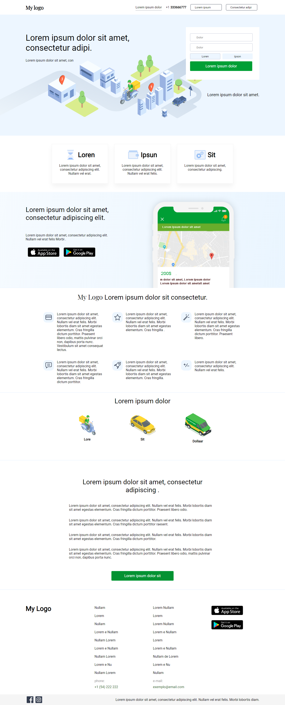

<h1 align="center">
    Get Start GitHub Project Template (replace with your project name)
</h1>

  

  
  
  

  

  

  <a href="#rocket-techs">Techs</a>&nbsp;&nbsp;&nbsp;|&nbsp;&nbsp;&nbsp;
  <a href="#-project">Project</a>&nbsp;&nbsp;&nbsp;|&nbsp;&nbsp;&nbsp;
  <a href="#-game">Layout</a>&nbsp;&nbsp;&nbsp;|&nbsp;&nbsp;&nbsp;
  <a href="#-how-to-contribute">How to Contribute</a>&nbsp;&nbsp;&nbsp;|&nbsp;&nbsp;&nbsp;
  <a href="#memo-license">License</a>&nbsp;&nbsp;&nbsp;|&nbsp;&nbsp;&nbsp;
  <a href="#-author">Author</a>

## :rocket: Techs

#### (replace with your project Technologies)
This project was developed with the following technologies:

- [Javascript](https://www.w3schools.com/js/)
- [HTML](https://www.w3schools.com/html/)
- [CSS](https://https://www.w3schools.com/css/)

## 💻 Project

#### (replace with your project description)
Project description

## Layout

#### (replace with your link preview project)
[Preview](https://github.com/codepro-ao/)

### Layout Exemple Image

#### (replace with your project layout)

## 🤔 How to Contribute

- Fork this repository;
- Create a branch with your feature: `git checkout -b my-feature`;
- Commit your changes: `git commit -m 'feat: my new feature'`;
- Push to your branch: `git push origin my-feature`.

After the merge of your pull request is done, you can delete your branch.

## :memo: License

#### (replace with your license project)
This project is under the MIT license. See the archive [LICENSE](LICENSE.md) for more details.

## Author
#### (replace with your author project)
[Carlos Garcia](https://github.com/CarlCr)

